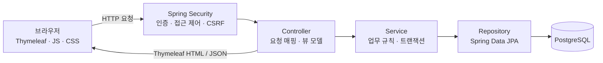
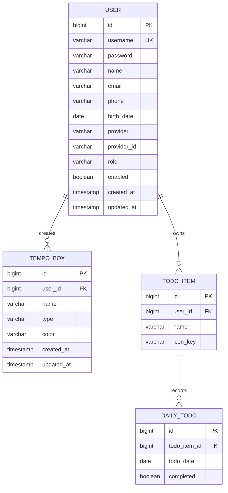

# Daily Tempo

Daily Tempo는 사용자가 자신만의 운동 템포를 만들고, 시각적인 리듬에 맞춰 운동하며, 캘린더에서 일별 수행 여부를 기록하는 웹 애플리케이션입니다.

Spring Boot와 Thymeleaf로 화면을 서버 사이드 렌더링하며, 사용자·템포·운동 기록은 PostgreSQL에 저장합니다.

## 주요 기능

### 회원 및 인증

- 아이디, 비밀번호, 이름, 휴대폰 번호, 생년월일을 이용한 회원가입
- Bean Validation을 통한 입력값 검증
- BCrypt를 이용한 비밀번호 해시 저장
- Spring Security 기반 폼 로그인 및 로그아웃
- 로그인한 사용자만 홈, 템포 운동, 캘린더에 접근 가능
- 사용자 소유 리소스를 사용자명으로 다시 조회해 다른 사용자의 데이터 접근 방지

현재 실제 인증 흐름은 로컬 계정(`LOCAL`)만 지원합니다. 도메인에는 NAVER, KAKAO, GOOGLE 공급자 값과 OAuth2 Client 의존성이 준비되어 있지만, 소셜 로그인 설정과 처리 로직은 아직 구현되어 있지 않습니다. 아이디·비밀번호 찾기 화면 역시 현재 안내용 페이지입니다.

### 커스텀 템포

- 템포 이름, 타입, 색상 선택
- 타입과 색상을 즉시 확인할 수 있는 미리보기
- 생성한 템포를 사용자별로 저장하고 홈에서 생성 순서대로 조회
- 템포 타입에 맞는 운동 화면으로 자동 이동

지원하는 템포 타입은 다음과 같습니다.

| 타입 | 동작 |
| --- | --- |
| `UPDOWN` | 사용자가 지정한 Up/Down 시간에 맞춰 색상 영역이 위아래로 반복 이동 |
| `DOT` | 사용자가 지정한 시간 간격으로 원형 표시가 점멸 |

운동 화면에서는 재생·일시정지가 가능하며, 입력한 시간 설정은 브라우저 `localStorage`에 보관됩니다. 시간 범위는 0.1초부터 60초까지입니다.

### 운동 캘린더

- 이전 달·다음 달 이동 및 월별 6주(42일) 캘린더 표시
- 오늘과 현재 선택한 달의 날짜 구분
- 달리기, 상체, 하체, 웨이트, 요가, 자전거, 수영, 스트레칭 아이콘 추가
- 사용자별 운동 항목 중복 추가 방지 및 삭제
- 날짜별 운동 완료 상태 토글
- 완료 상태를 비동기 요청으로 즉시 저장하고 아이콘 색상에 반영

## 기술 스택

| 영역 | 기술 |
| --- | --- |
| Language | Java 17 |
| Backend | Spring Boot 3.3.2, Spring MVC |
| View | Thymeleaf, HTML, CSS, JavaScript, jQuery |
| Security | Spring Security, BCrypt |
| Persistence | Spring Data JPA, Hibernate |
| Database | PostgreSQL |
| Validation | Jakarta Bean Validation |
| Build | Maven |

## 아키텍처

애플리케이션은 Controller, Service, Repository, Domain으로 역할을 나눈 전형적인 Spring 계층형 구조입니다.



### 계층별 책임

| 계층 | 주요 구성 요소 | 책임 |
| --- | --- | --- |
| Config | `SecurityConfig` | 공개·인증 경로 구분, 폼 로그인/로그아웃, `UserDetailsService`, BCrypt 설정 |
| Controller | `PageController`, `AuthController`, `TempoBoxController`, `CalendarController` | HTTP 요청 처리, 입력 검증 결과 처리, 모델 구성, 화면 또는 리다이렉트 반환 |
| Service | `UserService`, `TempoBoxService`, `CalendarTodoService` | 회원가입, 소유권 검증, 템포 생성, 캘린더 구성과 완료 상태 변경 |
| Repository | `UserRepository`, `TempoBoxRepository`, `TodoItemRepository`, `DailyTodoRepository` | 사용자별 데이터 조회와 JPA 영속화 |
| Domain | `User`, `TempoBox`, `TodoItem`, `DailyTodo` | 데이터 모델과 테이블 관계 표현 |
| View | `templates/*.html`, `static/assets/**` | Thymeleaf 화면 렌더링과 브라우저 내 템포 애니메이션·캘린더 상호작용 |

### 주요 요청 흐름

1. 요청은 Spring Security 필터를 거치며, 공개 경로가 아니면 인증이 필요합니다.
2. Controller가 인증 사용자명과 요청 값을 Service로 전달합니다.
3. Service가 업무 규칙과 데이터 소유권을 확인하고 트랜잭션 안에서 Repository를 호출합니다.
4. Repository가 JPA를 통해 PostgreSQL을 조회하거나 변경합니다.
5. 조회 화면은 Thymeleaf로 렌더링하고, 캘린더 완료 변경은 JSON으로 응답합니다.

운동 애니메이션 자체는 서버에서 매 프레임을 처리하지 않습니다. 서버가 저장된 템포 이름·타입·색상을 Thymeleaf 모델로 전달하면, 브라우저 JavaScript가 Web Animations API 또는 타이머를 이용해 재생합니다.

## 데이터 모델



- `users.username`은 고유합니다.
- `(users.provider, users.provider_id)` 조합은 고유합니다.
- `(daily_todos.todo_item_id, daily_todos.todo_date)` 조합은 고유해 한 운동 항목에는 날짜별 기록이 하나만 존재합니다.
- `TempoBox`와 `TodoItem` 조회·변경 시 인증 사용자명을 조건에 포함해 소유권을 확인합니다.

## 주요 경로

| Method | 경로 | 인증 | 설명 |
| --- | --- | --- | --- |
| GET | `/` | 불필요 | 시작 화면 표시 후 로그인으로 이동 |
| GET, POST | `/login` | 불필요 | 로그인 화면 및 Spring Security 로그인 처리 |
| GET, POST | `/membership` | 불필요 | 회원가입 화면 및 계정 생성 |
| POST | `/logout` | 필요 | 로그아웃 |
| GET | `/home` | 필요 | 사용자의 템포 박스 목록 |
| GET, POST | `/custom` | 필요 | 커스텀 템포 생성 화면 및 저장 |
| GET | `/exercise?id={id}` | 필요 | UpDown 템포 운동 |
| GET | `/exercise_dot?id={id}` | 필요 | Dot 템포 운동 |
| GET | `/calendar?month=YYYY-MM` | 필요 | 월간 운동 캘린더 (`/calender`도 호환) |
| POST | `/calendar/todos` | 필요 | 캘린더 운동 아이콘 추가 |
| POST | `/calendar/todos/delete` | 필요 | 캘린더 운동 아이콘 삭제 |
| POST | `/calendar/completion` | 필요 | 특정 날짜의 운동 완료 상태 변경 |

POST 요청에는 Spring Security의 CSRF 보호가 적용됩니다. HTML 폼은 Thymeleaf가 토큰을 포함하며, 캘린더의 비동기 요청은 페이지의 CSRF 메타데이터를 헤더로 전송합니다.

## 프로젝트 구조

```text
src/main/
├── java/com/dailytempo/
│   ├── config/          # Spring Security 설정
│   ├── controller/      # 페이지 및 폼/API 요청 처리
│   ├── domain/          # JPA 엔티티와 enum
│   ├── dto/             # 입력 폼과 화면 전달 모델
│   ├── repository/      # Spring Data JPA 저장소
│   ├── service/         # 업무 로직과 트랜잭션
│   └── DailyTempoApplication.java
└── resources/
    ├── application.properties
    ├── templates/       # Thymeleaf 템플릿
    └── static/assets/   # CSS, JavaScript, 이미지
```

루트의 `assets/`는 정적 원본과 같은 리소스를 포함하지만, Spring Boot 런타임에서 제공되는 경로는 `src/main/resources/static/assets/`입니다. `target/`은 Maven 빌드 산출물입니다.

## 실행 방법

### 요구 사항

- JDK 17 이상
- Maven 3.6 이상
- PostgreSQL

### 1. 데이터베이스 생성

PostgreSQL에 애플리케이션용 데이터베이스를 생성합니다.

```sql
CREATE DATABASE daily_tempo;
```

Hibernate 설정이 `spring.jpa.hibernate.ddl-auto=update`이므로 애플리케이션 실행 시 필요한 테이블이 자동으로 생성·갱신됩니다.

### 2. 환경 변수 설정

기본 연결 주소는 `jdbc:postgresql://localhost:5432/daily_tempo`입니다. 환경에 맞게 다음 값을 설정합니다.

```bash
export DB_URL='jdbc:postgresql://localhost:5432/daily_tempo'
export DB_USERNAME='postgres'
export DB_PASSWORD='your-password'
```

| 환경 변수 | 기본값 | 설명 |
| --- | --- | --- |
| `DB_URL` | `jdbc:postgresql://localhost:5432/daily_tempo` | PostgreSQL JDBC URL |
| `DB_USERNAME` | `kk_mac` | 데이터베이스 사용자 |
| `DB_PASSWORD` | 빈 값 | 데이터베이스 비밀번호 |

### 3. 애플리케이션 실행

```bash
mvn spring-boot:run
```

브라우저에서 [http://localhost:8085](http://localhost:8085)에 접속합니다.

### 빌드 및 테스트

```bash
mvn test
mvn clean package
java -jar target/daily-tempo-0.0.1-SNAPSHOT.jar
```

현재 저장소에는 별도의 테스트 소스가 없으므로 `mvn test`는 컴파일 및 테스트 실행 환경 구성을 검증하는 용도로 동작합니다.

## 설정 참고

- 서버 포트: `8085`
- Thymeleaf 캐시: 개발 편의를 위해 비활성화
- JPA Open Session in View: 비활성화
- 데이터베이스 스키마: Hibernate가 `update` 모드로 관리
- OAuth2 Client 의존성은 포함되어 있으나 공급자 등록 정보는 아직 설정되지 않음
